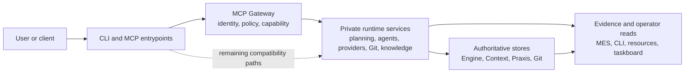
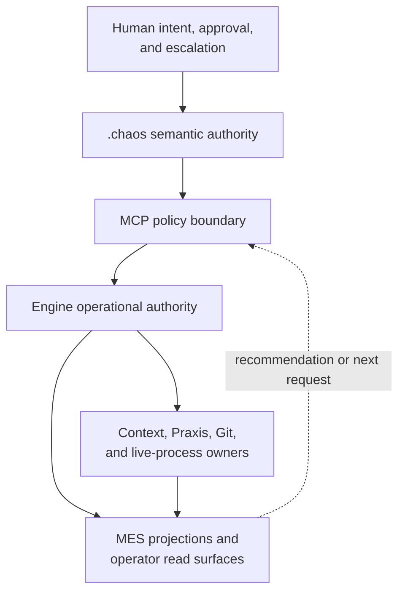
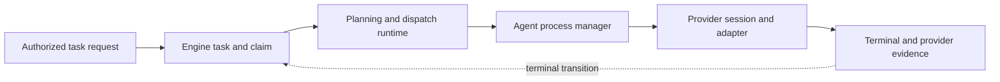
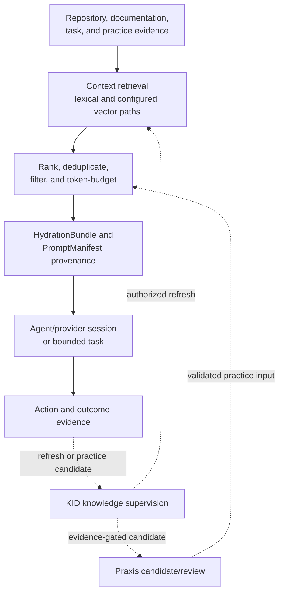
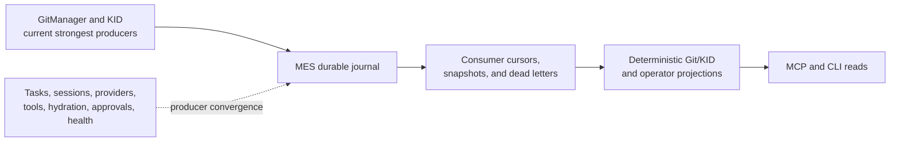
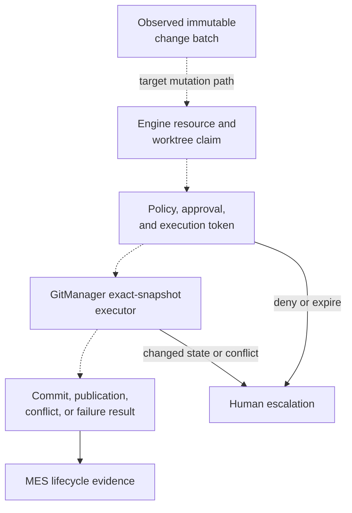
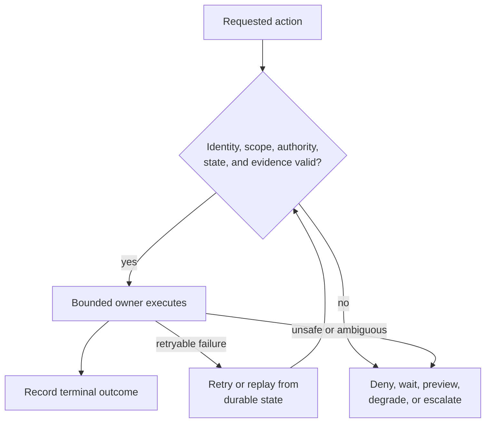
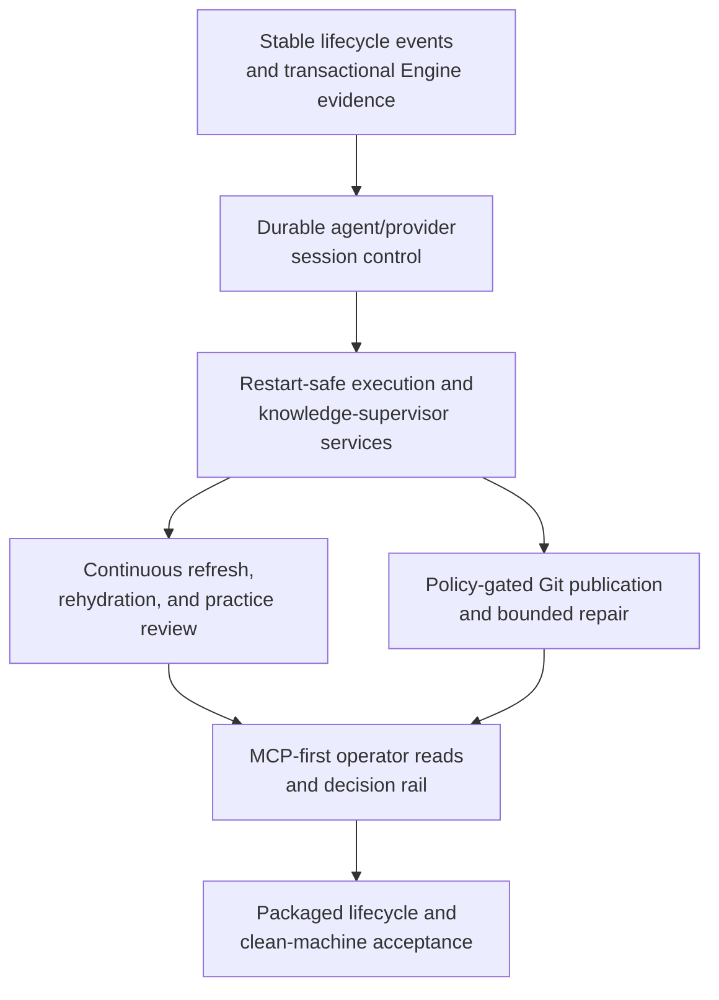

# CHAOS Component Map

> Evidence-controlled architecture and implementation map for the private CHAOS source repository and its convergence toward a connected local-first runtime.

> [!NOTE]
> This public document contains sanitized architecture descriptions. Referenced implementation and test paths belong to the private source repository and are cataloged in [Engineering Evidence](ENGINEERING-EVIDENCE.md). This map does not imply that source code is included here.

## Table of contents

- [1. Reading contract](#1-reading-contract)
- [2. Architecture principles](#2-architecture-principles)
- [3. System boundary](#3-system-boundary)
    - [Component status at a glance](#component-status-at-a-glance)
- [4. Authority and data ownership](#4-authority-and-data-ownership)
    - [Store and artifact ownership](#store-and-artifact-ownership)
- [5. Execution and orchestration](#5-execution-and-orchestration)
    - [Runtime ownership](#runtime-ownership)
    - [Provider boundary](#provider-boundary)
- [6. Context and knowledge plane](#6-context-and-knowledge-plane)
- [7. MES and Git integration](#7-mes-and-git-integration)
    - [MES action evidence](#mes-action-evidence)
    - [GitManager boundary](#gitmanager-boundary)
- [8. Safety, failure, and recovery](#8-safety-failure-and-recovery)
    - [Public safety boundary](#public-safety-boundary)
- [9. Deployment and operator posture](#9-deployment-and-operator-posture)
- [10. Convergence and completion threshold](#10-convergence-and-completion-threshold)
    - [Delivery phases](#delivery-phases)
    - [Connected-product acceptance](#connected-product-acceptance)
- [11. Evidence and navigation](#11-evidence-and-navigation)

| Map property | Value |
|---|---|
| Evidence cutoff | Private repository snapshot internally identified as `83ab168e`, audited 2026-07-30, plus architecture inspection through 2026-08-03 |
| Primary evidence | Executable source, migrations, tests, runtime configuration, and validated `.chaos` manifests |
| Target evidence | Accepted architecture decisions and explicitly marked active delivery specifications |
| Architecture authority | This map owns public architecture, implementation posture, ownership boundaries, open connections, recovery expectations, and completion criteria |
| Runtime-proof rule | File presence proves implementation—not a running, connected, packaged, or released system |

## 1. Reading contract

This map separates five evidence states:

| Status | Meaning |
|---|---|
| **Implemented/proven** | Source exists and focused tests or a bounded runtime proof verify the stated behavior. |
| **Implemented/unproven** | Source exists, but current runtime or integration proof was not established for the stated behavior. |
| **Active/partial** | A bounded connection exists, but the complete user, authority, recovery, or product path is not connected. |
| **Planned/open** | A target contract or migration is documented but is not current behavior. |
| **REQUIRES INSPECTION** | Available evidence does not support a defensible conclusion. |

The evidence hierarchy is:

1. Executable source, schema, migration, runtime configuration, or validated semantic manifest.
2. Focused test or bounded runtime proof, limited to the behavior it exercises.
3. Accepted architecture decision or active plan with explicit prerequisites and safety boundaries.
4. Unresolved inspection item.
5. Historical or stale references retained only for context.

Solid arrows in diagrams represent implemented or bounded current paths. Dashed arrows represent partial or planned composition. Neither style grants authority: authority remains with the owner named for that state or action.

## 2. Architecture principles

| Principle | Public contract | Current posture |
|---|---|---|
| **One external capability boundary** | The Model Context Protocol (MCP) Gateway is the intended external boundary for tools, resources, prompts, authentication, and policy. | Gateway composition is implemented; some compatibility CLI and setup paths remain outside uniform MCP control. |
| **Engine owns operational authority** | Tasks, assignments, claims, leases, execution sessions, approvals, tokens, and terminal results belong to Engine. | Core records and bounded services are implemented; uniform use and transactional event emission remain incomplete. |
| **Domain owners retain truth** | Context owns retrieval truth, Praxis owns reusable-practice truth, Git owns repository state, and runtime owners retain live process state. | Separate stores and services exist. Cross-owner mutation must continue through explicit owner APIs. |
| **MES owns evidence, not domain state** | The MCP Event System (MES) records correlated requests, attempts, results, transitions, observations, cursors, and rebuildable projections. | Core journal/replay behavior is implemented; producer coverage is strongest for GitManager and knowledge-integrity paths. |
| **Recommendations do not authorize actions** | Models, KID, Context, Praxis, observers, and user interfaces may recommend or project; they cannot silently acquire mutation authority. | Boundary exists in architecture and several implementations; uniform end-to-end proof remains active work. |
| **Write paths fail closed** | Missing identity, scope, permission, policy, approval/token, correlation, credentials, or evidence must deny, wait, preview, or escalate. | Substantial gateway and Git/MES behavior exists; not every compatibility path is uniformly governed. |
| **Git outcomes remain explicit** | GitManager must distinguish clean integration, conflicts, changed state, configuration failures, and transient failures rather than infer success. | Managed reconciliation and typed outcomes are implemented and tested. Additional mutation automation remains gated. |
| **Product completion requires composition** | Source, tests, diagrams, or plans alone do not prove the connected product. | The project explicitly tracks bounded proof separately from connected runtime and release acceptance. |

## 3. System boundary

The public boundary is intentionally narrow. External callers should enter through MCP-governed capabilities or read-only operator surfaces. Private services perform bounded work against the owners of state. MES and operator views expose evidence without becoming alternate mutation planes.

### Component status at a glance

| Component family | Responsibility | Status | Primary missing connection |
|---|---|---|---|
| `.chaos` semantic authority | Defines agent, command, skill, hook, client, and workflow meaning across rendered client views | **Implemented/proven** | Complete runtime delivery and drift-free consumption across the full catalog |
| MCP Gateway | External capabilities, authentication, validation, scopes, policy, audit reservation, and resources | **Implemented/proven** | Uniform ownership of all write-capable entrypoints and complete catalog-health reporting |
| Engine operational authority | Tasks, assignments, claims, leases, execution sessions, approvals, tokens, results, and control evidence | **Implemented/proven** | Transactional lifecycle events and uniform use across remaining runtime paths |
| PM, agents, and provider runtime | Planning, routing, dispatch, process lifecycle, provider sessions, supervision, and terminal state | **Active/partial** | One restart-safe continuous worker with durable pause, input, cancellation, and recovery |
| Context and hydration | Multi-store retrieval, ranking, deduplication, budgeting, provenance, prompt assembly, and injection contracts | **Implemented/proven** | Continuous knowledge refresh, session rehydration, and evidence-gated feedback |
| Praxis | Stores and evaluates reusable practices and related feedback/projection data | **Active/partial** | Closed candidate, review, promotion, and regression loop under knowledge supervision |
| KID knowledge supervision | Runs knowledge-integrity jobs, reconciliation, trust/claim handling, projections, and degraded-mode controls | **Active/partial** | Packaged continuous supervision of Context/Praxis refresh and session hydration |
| MES | Durable events, delivery, journals, cursors, snapshots, replay, dead letters, and projections | **Implemented/proven core** | Producer coverage for tasks, sessions, providers, tools, hydration, approvals, and health |
| GitManager | Managed clone fleet, reconciliation, merge ingestion, transport, conflicts, and Git evidence | **Implemented/proven bounded slice** | Policy-gated exact-snapshot commits, publication, and bounded repair sessions |
| Deployment and operator surfaces | Development topology, installer, CLI, MCP resources, status, event-tail, and read-only taskboard | **Active/partial** | Packaged workers, lifecycle operations, clean-machine proof, and unified operator shell |

## 4. Authority and data ownership

The layers answer different questions:

| Layer | Question it answers | What it cannot do |
|---|---|---|
| Human authority | What outcome is wanted, what risk is acceptable, and when should work proceed? | Does not replace runtime validation or prove that an action completed. |
| `.chaos` semantic authority | What workflows, agents, commands, skills, and client views are intended? | Is not an execution token or mutable runtime state. |
| MCP Gateway | Is this caller and request allowed to invoke this registered capability under current policy? | Does not own tasks, repositories, retrieval truth, or terminal results. |
| Engine | Who owns the work, which claim or approval is active, and what control state is durable? | Does not become the canonical repository, Context, or Praxis store. |
| Domain owners | What is the canonical Context, Praxis, Git, or live-process state? | Cannot bypass Engine or gateway authority for externally initiated write behavior. |
| MES and read models | What was requested, attempted, observed, changed, completed, denied, or escalated? | Cannot turn evidence or a recommendation into permission. |

### Store and artifact ownership

| State or artifact | Canonical owner | Evidence relationship |
|---|---|---|
| Tasks, assignments, claims, leases, approvals, execution tokens, results | Engine | MES should record correlated lifecycle events and projections. |
| Context sources, rankings, hydration provenance, retrieval truth | Context | MES should reference bounded hydration artifacts without copying repository bodies. |
| Reusable practices, feedback, review, and promotion state | Praxis | MES should capture candidate/review/promotion lifecycle evidence. |
| Repository, branch, commit, index, conflict, and worktree state | Git and GitManager | MES records typed actions and outcomes; Git remains canonical. |
| Live process, terminal, and provider-session state | Runtime owner | Engine retains durable session/control evidence; MES records lifecycle transitions. |
| Workflow and client-view meaning | `.chaos` manifests | Generated views should be reproducible and validated against semantic authority. |
| Correlated action events, cursors, snapshots, and projections | MES within Engine persistence | Projections are rebuildable evidence, not a fourth business-authority store. |

## 5. Execution and orchestration

The private implementation supports bounded task and process paths, including a focused proof that connects durable Engine task records, concurrent claim protection, provider/session execution, actions, and terminal status. It does not yet operate as one packaged worker that continuously claims tasks, maintains durable conversational control, and safely recovers all provider work after restart.

### Runtime ownership

| Runtime concern | Current behavior | Status |
|---|---|---|
| Task creation and concurrent claims | Durable Engine records and bounded claim protection | **Implemented/proven** |
| Planning and dispatch | PM runtime and dispatch components coordinate bounded work | **Active/partial** |
| Agent process lifecycle | Managed local processes, queues, output, and concurrency behavior | **Implemented/proven** |
| Provider sessions | Persistent session records, attach/send/interrupt/focus behavior, and terminal evidence | **Implemented/proven bounded slice** |
| Continuous supervision | Supervision primitives and read models exist | **Active/partial** |
| Durable pause, human input, and restart recovery | Target state-machine and recovery behavior | **Planned/open** |

### Provider boundary

| Provider path | Current implementation | Target relationship |
|---|---|---|
| Claude, Copilot, Codex, Gemini, and Aider | Explicit local CLI adapters | Continue as policy-described executors where installed. |
| Controlled passthrough | Generic command wrapper | Retain for testing and bounded compatibility. |
| Custom extension seam | Source-level adapter seam exists | Require typed schema, capability, locality, credential, and evidence review before normal registration. |
| OpenRouter | No first-class adapter in the audited implementation | Planned normalized remote-provider implementation. |
| Local model service | No first-class Ollama, vLLM, LM Studio, or Docker Model Runner adapter in the audited implementation | Planned privacy-first implementation behind the same provider contract. |

The target provider contract must normalize request/result semantics, capability discovery, locality and data-egress class, credential policy, budget/quota behavior, cancellation, timeout, retry, partial output, and redacted evidence. Provider adapters execute work; they do not acquire operational authority.

## 6. Context and knowledge plane

The implemented hydration path can query Context, Praxis, and permitted read-only Engine sources; use lexical and configured vector retrieval; rank and deduplicate candidates; enforce a token budget; retain source and selection provenance; and assemble provider/task injection artifacts.

The missing connection is continuous knowledge lifecycle ownership around that algorithm. The KID knowledge-integrity runtime implements workers, trust and claim handling, reconciliation, projections, MES-triggered jobs, and degraded-mode controls, but does not yet continuously own the full sequence of change detection, index refresh, session rehydration, Praxis candidate review, and hydration lifecycle evidence.

| Knowledge behavior | Status | Boundary |
|---|---|---|
| Multi-store retrieval, scoring, budgeting, and hydration provenance | **Implemented/proven** | Retrieval results remain Context-owned evidence. |
| Provider/task prompt assembly with hashes and redaction contracts | **Implemented/proven** | Prompt artifacts do not become canonical repository truth. |
| KID worker jobs, reconciliation, projections, and degraded modes | **Active/partial** | Continuous packaged supervision remains incomplete. |
| Praxis feedback and evolution components | **Active/partial** | No complete evidence-gated promotion loop is connected. |
| Session-aware initial hydration and bounded refresh | **Planned/open** | Must preserve lineage and avoid silent prompt replacement. |
| Bounded evidence for Engine decisions | **Planned/open** | Context and KID may supply evidence but cannot make the Engine decision. |

## 7. MES and Git integration

### MES action evidence

MES separates lifecycle meanings so that a request is not a result and an observation is not authority. Its current core includes durable events, journals, consumers, cursors, snapshots, replay, dead letters, and projections. The principal gap is breadth: several domain families have records or partial evidence without a complete correlated MES producer lifecycle.

| Producer family | Current posture | Required connection |
|---|---|---|
| GitManager and FileTransport | **Implemented/proven** | Extend vocabulary only when additional Git actions become authorized. |
| KID knowledge events | **Implemented/proven** | Package continuous supervision and restart proof. |
| Engine tasks, claims, approvals, and tokens | **Active/partial** | Emit state transition and event atomically. |
| Agent and provider sessions | **Active/partial** | Add complete durable lifecycle, input, interruption, and recovery events. |
| Tools, files, and hydration | **Planned/open beyond Git subset** | Record bounded arguments, hashes, provenance references, and outcomes without raw-content duplication. |
| Runtime health and recovery | **Active/partial** | Establish common degraded, retry, recovered, and human-required semantics. |

### GitManager boundary

The current GitManager slice manages registered clone fleets, lifecycle, merge/reconcile behavior, FileTransport evidence, and typed conflict outcomes. It preserves unresolved conflicts and distinguishes configuration or transient failures instead of rewriting history or reporting success.

| Git behavior | Status | Required guards |
|---|---|---|
| Reconcile preview and managed status | **Implemented/proven** | Registered repository and authenticated internal boundary |
| Managed merge/reconciliation and conflict classification | **Implemented/proven** | Fleet ownership, expected state, and typed terminal outcome |
| Dirty-worktree commit | **Planned/open** | Immutable path/hash batch, claim, policy, exact staging, validation |
| Remote branch publication and Draft PR creation | **Planned/open** | Expected source state, short-lived credential, deduplication, terminal evidence |
| Model-assisted repair | **Planned/open** | Bounded paths, lease, retry budget, verification, and escalation |
| Protected merge/publication | **REQUIRES INSPECTION** | Explicit human/product policy and complete audit trail |

## 8. Safety, failure, and recovery

| Failure mode | Safe behavior | Recovery expectation |
|---|---|---|
| Engine unavailable | Disable Engine-dependent writes and expose degraded state | Reconnect and resume from durable control/evidence state. |
| Duplicate or conflicting event | Deduplicate or reject the conflicting transition | Continue from valid cursor or correct source identity before replay. |
| Consumer failure | Do not advance snapshot/cursor as successful | Retry within budget, dead-letter when exhausted, and support rebuild. |
| Provider interruption | Mark interrupted, failed, or orphaned; never infer completion | Attach or recover when supported, otherwise begin a new authorized session. |
| Git conflict or changed snapshot | Pause only the affected lane and preserve repository state | Escalate or run an approved bounded repair against a new exact snapshot. |
| Missing or invalid credential | Deny remote publication | Acquire an authorized short-lived credential and rerun under current state. |
| Migration or required dependency failure | Keep affected service unavailable or read-only | Correct configuration/migration and restart with explicit health evidence. |
| Observer or projection failure | Keep canonical owners and deterministic evidence running | Resume from an independent cursor; never substitute mutation as fallback. |

### Public safety boundary

The current architecture includes meaningful policy, scope, claims, conflict, and evidence controls, but uniform product-wide enforcement remains incomplete. Public claims must therefore remain bounded. This map intentionally avoids publishing credentials, raw logs, provider payloads, personal paths, internal addresses, or a detailed exploit-oriented inventory of incomplete controls.

## 9. Deployment and operator posture

The strongest current topology is a local development runtime with separate Engine, Context, and Praxis PostgreSQL stores, an MCP service, and a private GitManager service. The codebase also contains CLI, installer, status, event-tail, MCP resource, and read-only taskboard surfaces.

| Surface | Current status | Product gap |
|---|---|---|
| Three-store development topology | **Implemented/proven bounded topology** | Automated lifecycle and clean-machine release proof |
| MCP service and private GitManager | **Active/partial composition** | Complete worker/provider packaging and unified health |
| PM/agent continuous worker | **Planned/open as packaged service** | Restart, reclaim, duplicate prevention, pause/input, and recovery proof |
| KID continuous knowledge service | **Active/partial** | Packaged supervision of refresh, hydration, and practice feedback |
| CLI and MCP read surfaces | **Implemented/proven bounded reads** | Complete command parity and explicit degraded-state presentation |
| Read-only taskboard and installer | **Implemented/unproven product surfaces** | Unified task-centered operator workflow |
| Unified web/operator console | **Planned/open** | Projection-first interface and approval rail without direct domain mutation |
| Backup, export, upgrade, and rollback | **REQUIRES INSPECTION** | Governed lifecycle contract and retained-state proof |

The intended operator experience is a projection and decision client over MCP—not a second control plane. Critical reads and decisions require CLI parity. No interface should mutate databases, Git, processes, Context, or Praxis directly.

## 10. Convergence and completion threshold

### Delivery phases

1. **Complete authority and event semantics.** Engine state transitions and correlated lifecycle evidence must commit consistently, distinguish request from result, and rebuild deterministically.
2. **Make sessions durable.** Agent and provider execution must support explicit input-needed, cancellation, interruption, timeout, terminal status, restart, and recovery behavior.
3. **Package continuous supervision.** One Engine-supervised execution worker and one KID knowledge-supervisor service must claim work, expose health, and recover without duplication or false-green state.
4. **Connect knowledge lifecycle.** KID must supervise Context refresh, bounded session rehydration, and evidence-gated Praxis candidates without acquiring operational authority.
5. **Authorize additional Git behavior.** Commits, publication, and repair require immutable snapshots, claims, policy, verification, short-lived credentials, and human escalation.
6. **Expose one operator contract.** Read models, degraded state, approvals, conflicts, hydration lineage, and terminal evidence must be available through MCP-first CLI and interface surfaces.
7. **Prove the packaged product.** Installation, migrations, persistence, backup/export, upgrade/rollback, provider dispatch, restart, and clean-machine acceptance must pass together.

### Connected-product acceptance

CHAOS reaches the completion threshold represented by this map when a new user can, on a clean supported machine:

1. Install the released package and initialize or migrate the Engine, Context, and Praxis stores.
2. Connect a repository and register its managed clone/worktree topology.
3. Authenticate through MCP and select a permitted local or explicitly authorized remote provider.
4. Start restart-safe execution and knowledge-supervisor services with visible health.
5. Submit an objective that becomes durable Engine tasks, assignments, claims, sessions, and provider work.
6. Receive a traceable hydration bundle and perform bounded rehydration without losing lineage.
7. Pause for durable human input and approve exactly one immutable write snapshot.
8. Execute through the correct domain owner, including GitManager for authorized Git/GitHub work.
9. Inspect a complete correlated timeline containing requests, attempts, transitions, observations, failures, recovery, and terminal results.
10. Restart the runtime and recover task, session, claim, cursor, knowledge, hydration, Git, and operator state without inferred success.
11. Export and delete governed operational, transcript, Context, and Praxis data under explicit lifecycle policy.
12. Complete the journey without direct database access, private service access, unscoped shell authority, or interface-owned mutation.

Until those gates pass, the correct product claim is:

> **CHAOS is substantially implemented, partially connected, and not yet proven as one continuous local-first product runtime.**

## 11. Evidence and navigation

| Document | Role |
|---|---|
| [README.md](README.md) | Public orientation, technical ownership, headline status, and repository boundary |
| [SHOWCASE.md](SHOWCASE.md) | Employer-facing engineering narrative, verified slices, differentiators, and limitations |
| [ENGINEERING-EVIDENCE.md](ENGINEERING-EVIDENCE.md) | Private-source audit measurements, representative implementation paths, and test-backed proof inventory |

The architecture is intentionally ambitious, but the publication standard remains conservative: implementation claims require executable evidence, connected-product claims require integrated proof, and release claims require clean-machine lifecycle acceptance.
