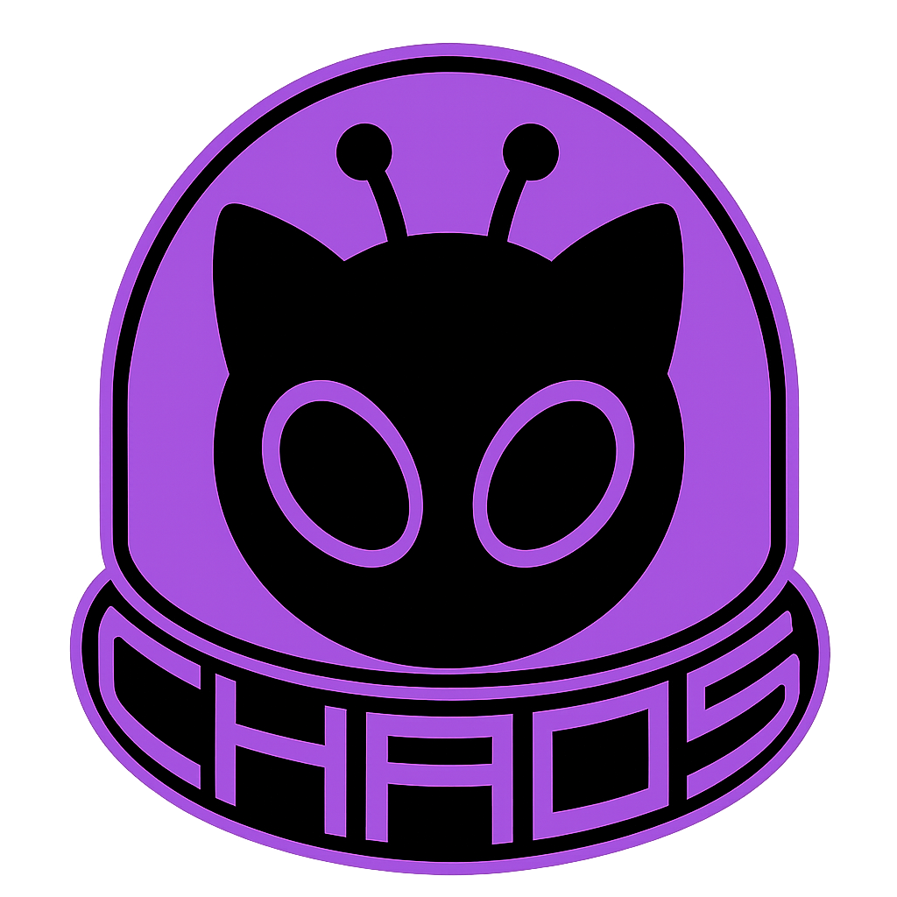
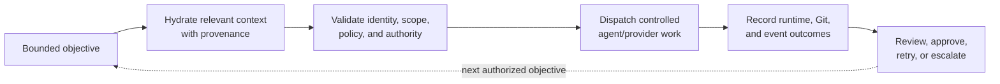

# CHAOS

Local-first coordination for coding-agent work

**Context Hydrated Agentic Orchestration System**
*Persistent context, policy-gated execution, Git reconciliation, and inspectable action evidence.*

[Website](https://chaos-dev.ai) · [Showcase](SHOWCASE.md) · [Component Map](COMPONENT-MAP.md) · [Engineering Evidence](ENGINEERING-EVIDENCE.md)

|  | GitHub | LinkedIn | Resume |
|---|---|---|---|
| Izzy Schlichting | [@iz444zy](https://github.com/iz444zy) | [Profile](https://www.linkedin.com/in/isa-lucia-sch/) | --- |
| Daniella Schlichting | [@dani-sch](https://github.com/dani-sch) | [Profile](https://www.linkedin.com/in/daniella-schlichting/) | --- |

---

> [IMPORTANT]
> This repository is a sanitized, documentation-only technical showcase of CHAOS. The implementation remains in a private source repository. This public repository is not a runnable distribution, source mirror, or claim of a completed product.

> [!WARNING]
> Copyright 2026 CHAOS-AI. All rights reserved. This material is available only for personal, non-commercial research, evaluation, and citation. Copying, reuse, derivative works, model training, distribution, or commercial use requires prior written permission. See [LICENSE](LICENSE).

CHAOS is multi-agent development infrastructure for software work that must survive the boundaries between conversations, providers, terminals, repositories, worktrees, and human review. It retrieves bounded project context, coordinates controlled execution, reconciles Git state, and preserves durable evidence of what was requested, attempted, completed, rejected, or escalated.

It is not a generic chat interface or an unrestricted autonomous coding bot. CHAOS separates workflow meaning, operational authority, retrieval truth, reusable practice knowledge, repository state, and action history so that no recommendation, event, or model response silently becomes permission to mutate a system.

## Technical ownership

CHAOS was independently architected and implemented by **Izzy Schlichting & Daniella Schlichting** through an agentic development workflow. Coding agents were used as implementation collaborators; the architecture, system decomposition, specifications, integration strategy, verification standards, audit design, and final technical decisions were directed and governed by Izzy and Daniella.

Repository line, test, and commit counts describe the resulting codebase. They are not presented as manually typed output or as a substitute for connected runtime proof.

## How CHAOS approaches a unit of work

This is the intended controlled lifecycle. Its component families are substantially implemented, but not every arrow is connected as one continuously supervised, restart-safe product service today. The strongest current proofs cover focused runtime slices rather than an unattended request-to-merged-pull-request loop.

## Core engineering areas

| Area | Current bounded capability |
|---|---|
| **Context and hydration** | Retrieves across Context, Praxis, and permitted read-only Engine sources; ranks, deduplicates, token-budgets, and retains selection provenance in hydration artifacts. |
| **MCP Gateway** | Applies authentication, schema, mode, entitlement, capability, approval, execution-token, and audit-reservation checks before registered handlers run. |
| **Operational authority** | Engine records tasks, assignments, claims, leases, execution sessions, approvals, tokens, results, and related control evidence. |
| **Agent and provider runtime** | Manages bounded planning, dispatch, agent processes, provider sessions, terminal state, and local CLI adapters. Continuous restart-safe supervision remains active integration work. |
| **GitManager** | Manages registered clone fleets, reconciliation, merge outcomes, conflict classification, and Git evidence without interpreting a requested mutation as successful. |
| **MES and KID** | Maintains durable correlated action events, cursors, replay, and projections. GitManager and knowledge-integrity paths currently have the strongest producer coverage. |
| **Operator surfaces** | Exposes CLI, Model Context Protocol (MCP) resources, status, event-tail, installer, and read-only taskboard surfaces. A unified operator interface is not yet shipped. |

## Current implementation boundary

| Proven or bounded today | Still being connected or completed |
|---|---|
| Gateway policy preflight and Engine control records | Uniform policy ownership across remaining compatibility entrypoints |
| Multi-store retrieval, ranking, budgeting, and hydration provenance | Continuous knowledge refresh and session rehydration |
| Bounded task claiming and real-agent dispatch proof | Restart-safe worker supervision and durable pause/input behavior |
| Managed Git fleet lifecycle, reconciliation, and typed conflict outcomes | Policy-gated commits, remote publication, and bounded repair sessions |
| Durable MES journals, cursors, replay, and Git/KID projections | Full event coverage for tasks, sessions, providers, tools, hydration, approvals, and health |
| Development runtime topology and read surfaces | Clean-machine packaging, release lifecycle proof, and a unified operator experience |

CHAOS does **not** currently claim a production-ready unified interface, complete autonomous Git publication, autonomous conflict repair, final merge automation, or a packaged unattended request-to-merged-PR loop. Source presence is not treated as product completion: a capability must have connected composition, focused proof, appropriate recovery behavior, and current documentation before it is presented as complete.

## Audited private-source evidence

The latest repository-wide measurement included in this showcase is tied to the private-source snapshot internally identified as `83ab168e`, audited on **2026-07-30**. The measurements describe that snapshot, not the current working tree or release readiness.

| Audited measure | Value |
|---|---:|
| Source Python files | 475 |
| Source Python LOC | 92,204 |
| Test Python files | 459 |
| Test Python LOC | 91,612 |
| Test-to-source Python LOC ratio | 99.4% |
| Collected tests | 6,910 |
| Statement coverage | 72.07% |

The audit recorded 6,766 passing tests, but the retained public-safe summary does not classify the remaining collected outcomes. This showcase therefore does not characterize them as failures, skips, expected failures, or environment-blocked tests. See [Engineering Evidence](ENGINEERING-EVIDENCE.md) for the measurement method, representative proof paths, and publication boundary.

## Why the system is staged

CHAOS contains multiple interdependent engines rather than one monolithic agent loop. Engine must establish durable authority before a continuous worker can act safely. Runtime sessions require normalized lifecycle and recovery contracts before they can survive interruption. Knowledge systems must improve retrieval without gaining operational authority. MES requires stable event semantics before it can represent a trustworthy cross-system timeline. GitManager needs those same authority, credential, and evidence boundaries before additional mutation can be automated.

The result is intentionally staged convergence: build each owner to a defensible contract, prove bounded behavior, connect it through explicit APIs and evidence, and only then present the composition as product behavior.

## Read the showcase

| If you want to... | Read |
|---|---|
| Understand the problem, differentiators, and target experience | [SHOWCASE.md](SHOWCASE.md) |
| Inspect ownership boundaries, implementation posture, recovery, and completion criteria | [COMPONENT-MAP.md](COMPONENT-MAP.md) |
| Review dated measurements, representative source paths, and test-backed traces | [ENGINEERING-EVIDENCE.md](ENGINEERING-EVIDENCE.md) |

## Public history notice

The public commit and pull-request history is a sanitized, non-code reconstruction of development milestones from the private source repository. It preserves project chronology and engineering intent where practical, but public hashes, metadata, descriptions, and diffs are not a cryptographic mirror and do not independently verify the private implementation.
