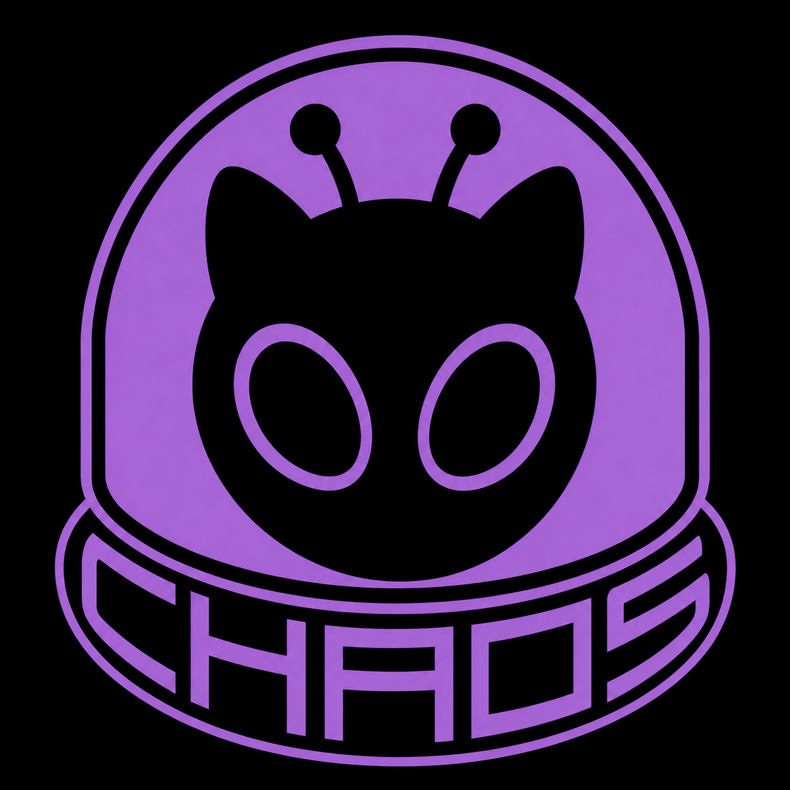
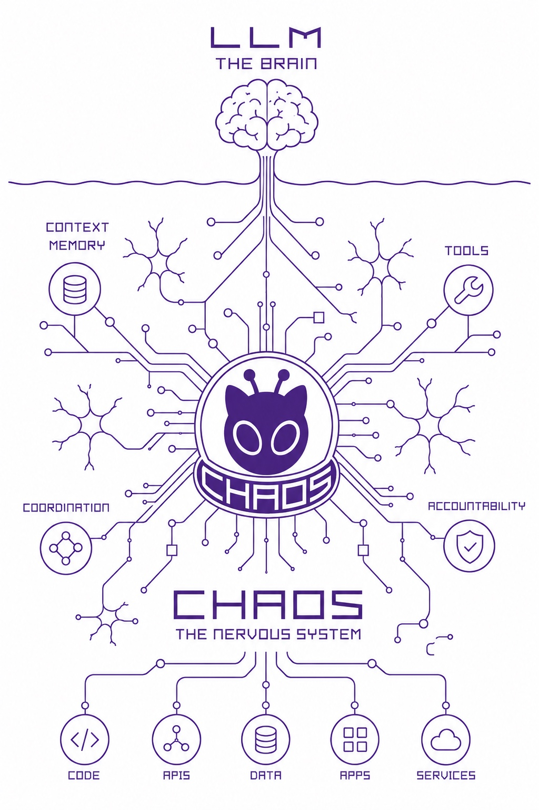

# CHAOS

> *Orchestrated intelligence. Controlled chaos.*

  

CHAOS is a **local-first AI infrastructure layer for software work**. The simplest framing is: **the LLM is the brain; CHAOS is the nervous system that helps the brain remember, coordinate, automate, and act with better context.**

AI models are powerful reasoning engines, but real development work needs more than one-off intelligence. It needs persistent memory, task coordination, workflow discipline, operational visibility, and efficient use of context. CHAOS is being developed around that missing operating layer.

  

This repository is a **sanitized public showcase**. It is meant to demonstrate the way the project is run: commit cadence, documentation maintenance, release rhythm, git hygiene, and the overall shape of the product direction. It does **not** reproduce the private implementation repository.

## What CHAOS is about

At a high level, CHAOS is being developed to make AI-assisted software work:

- more persistent across sessions,
- more structured across planning, implementation, review, documentation, and handoff,
- more coordinated across agents, repositories, and local machines,
- more operationally visible and auditable,
- less dependent on re-explaining the same context over and over,
- and less wasteful with model tokens and provider resources.

The private product work explores how a local-first system can coordinate workflow surfaces, carry forward useful context, orchestrate repeatable processes, and support disciplined engineering execution without turning the development process into a pile of disconnected tools.

## Deployment shape

The intended product shape is a local deployment that can be plugged into existing AI development interfaces rather than replacing them:

- a **Dockerized local runtime** for the core platform services,
- an **MCP-compatible local server** for tool, resource, and workflow access,
- a **localhost web interface** designed to run locally and be opened inside the Codex browser,
- integration points for existing AI provider development surfaces, including desktop tools, IDE integrations, and CLIs,
- and cross-platform operation across **Windows, macOS, and Linux**.

In practical terms, CHAOS is meant to become the local operating layer that existing AI tools can connect to through MCP-compatible interfaces.

## Public-safe concept

CHAOS can be understood as a runtime nervous system around AI-assisted development:

- **Context memory** keeps useful project knowledge from disappearing between sessions.
- **Tiered context injection** sends the model relevant signal instead of flooding it with raw project material.
- **Orchestration** coordinates work across agents, child repo clones, local machines, and workflow stages.
- **Automation** turns repeatable development processes into structured flows.
- **Auditability** makes work easier to inspect, replay, and trust.
- **Local-first operation** keeps the user's machine as the center of gravity.

This creates a win for both AI users and AI providers: users get better continuity and higher-quality assistance, while providers face less avoidable token waste from repeated context loading and oversized prompts.

## What this showcase preserves

This public repository is intentionally focused on **process evidence**:

- conventional commit discipline,
- timestamp-faithful replay of the original development cadence,
- a visible changelog and development-log rhythm,
- multi-phase repository evolution over time,
- public-safe product and architecture summaries.

## What this showcase does not include

To keep the showcase useful without exposing direct IP, it intentionally excludes:

- private source code,
- protected implementation details,
- raw internal planning and operating documents,
- seeded demo data and environment-specific operational material,
- legal, business, patent, or trade-secret documentation.

## What you should read first

- [docs/WHAT-IS-CHAOS.md](docs/WHAT-IS-CHAOS.md) — plain-language concept explanation
- [docs/ARCHITECTURE-OVERVIEW.md](docs/ARCHITECTURE-OVERVIEW.md) — simplified public architecture diagram
- [docs/DEV-LOG-HIGHLIGHTS.md](docs/DEV-LOG-HIGHLIGHTS.md) — major evolution themes
- [docs/SHOWCASE-REPLAY-PLAN.md](docs/SHOWCASE-REPLAY-PLAN.md) — how this showcase history was reconstructed
- [CHANGELOG.md](CHANGELOG.md) — generalized release narrative

## Why the history matters here

One of the main things this showcase is intended to demonstrate is that the project was handled with **care over time**, not just assembled into a polished snapshot at the end. The replayed commit history preserves the original ordering and timestamps so the public repo still reflects the pace, rhythm, and sequencing of the underlying work.

That means the value of this repository is not just in its files; it is also in the visible pattern of:

- how features and fixes accumulated,
- how documentation moved alongside implementation,
- how cleanup and refactor work kept happening,
- how the project evolved in phases instead of all at once.

## Public-safe framing

The cleanest way to read this repository is:

> **This is a process showcase derived from a private product repository.**

It is designed to communicate:

1. what CHAOS is trying to become,
2. how the work has been managed,
3. what kind of engineering discipline shaped the product,
4. and what the repository history says about that operating style.

## Repository notes

Because this is a public-safe showcase:

- commit subjects may be lightly sanitized where needed,
- commit bodies are intentionally generalized,
- docs focus on product direction and workflow quality,
- implementation detail is abstracted rather than reproduced.
