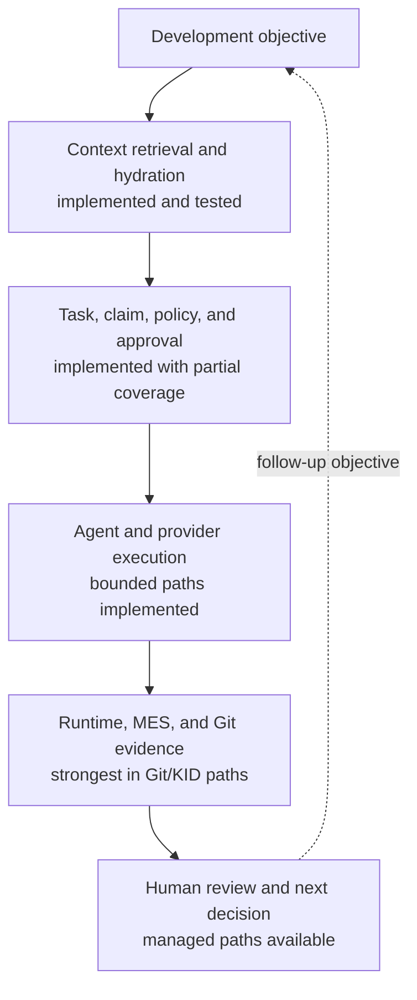

# CHAOS: Technical Showcase

> **CHAOS is a local-first operating layer for software work with coding agents: it retrieves bounded project context, coordinates controlled execution, and leaves inspectable evidence of what happened.**

CHAOS—**Context Hydrated Agentic Orchestration System**—is multi-agent development infrastructure designed for work that extends beyond one model response, terminal, worktree, or review window. It combines persistent context retrieval, task and session coordination, policy-gated tool access, Git reconciliation, and durable action history.

This document presents the engineering problem, implemented capability families, verified runtime slices, and intended connected experience. The implementation remains private, and the connected product is still in development. Architecture status and completion criteria are governed by the [Component Map](COMPONENT-MAP.md); measurements and representative proof paths are recorded in [Engineering Evidence](ENGINEERING-EVIDENCE.md).

## Table of contents

- [The problem](#the-problem)
- [Operating model](#operating-model)
- [Why convergence is staged](#why-convergence-is-staged)
- [Target workflow assembled from verified engineering slices](#target-workflow-assembled-from-verified-engineering-slices)
- [Engineering differentiators](#engineering-differentiators)
    - [Context with provenance, not a blank prompt](#context-with-provenance-not-a-blank-prompt)
    - [Operational authority outside the model](#operational-authority-outside-the-model)
    - [Controlled multi-agent and provider execution](#controlled-multi-agent-and-provider-execution)
    - [Durable, replayable action evidence](#durable-replayable-action-evidence)
    - [Git-native coordination with failure boundaries](#git-native-coordination-with-failure-boundaries)
    - [Local-first, modular architecture](#local-first-modular-architecture)
- [Engineering ownership](#engineering-ownership)
- [Selected dated proof](#selected-dated-proof)
- [Current status](#current-status)
- [Honest limitations](#honest-limitations)
- [Direction](#direction)

## The problem

Coding agents are effective within a bounded interaction, but software development rarely fits inside one interaction. Important project context is scattered across source, documentation, issues, prior sessions, terminals, branches, worktrees, and human decisions. When the next session begins, developers often have to reconstruct that state manually.

The problem becomes larger when several agents or providers participate:

- Which task and repository state did an agent actually receive?
- Which work is active, waiting, failed, or complete?
- Who or what currently owns a task, worktree, or approval?
- Did a requested tool or Git operation succeed, or was it only attempted?
- Can a later session recover the relevant context and decisions without replaying an entire transcript?
- When should the system stop and require human review?

CHAOS treats these as infrastructure problems rather than prompt-writing problems. It separates operational authority from model recommendations, retrieval results, repository state, and event history so that work can be inspected, recovered, and handed off without granting unrestricted mutation authority.

CHAOS is intended for:

- Developers who work extensively with coding agents and need continuity across sessions.
- Small technical teams coordinating independent agent work across repositories and worktrees.
- Engineers building agent platforms that require explicit policy, authority, replay, and recovery boundaries.
- Teams that want Git-native evidence and reproducible execution rather than chat-only history.

## Operating model

The name describes the system's design:

- **Context Hydrated:** agents receive selected, ranked, token-budgeted project evidence with provenance rather than starting from a blank conversation or an unbounded repository dump.
- **Agentic Orchestration:** planning, task, agent, provider, and Git components coordinate through explicit ownership and control boundaries.
- **System:** context, execution, repository state, practice knowledge, and action history remain distinct domain concerns even when they participate in one unit of work.

The diagram is a product-level view, not a claim that every step currently runs as one unattended service. Focused implementations and tests prove substantial slices of the lifecycle; continuous supervision, complete cross-system event coverage, and packaged operator behavior remain active integration work.

## Why convergence is staged

The major CHAOS components are interdependent, but connecting them prematurely would create ambiguous authority and unreliable evidence.

Engine must establish durable tasks, claims, approvals, execution tokens, and terminal results before a continuous worker can safely act. Agent and provider sessions need normalized interruption, input, cancellation, and recovery semantics before work can survive restart. Context, Praxis, and the knowledge-integrity runtime must improve retrieval without silently becoming operational decision-makers. The **MCP Event System (MES)** needs stable producer semantics and correlation before its timeline can be treated as trustworthy. GitManager needs the same authority and evidence boundaries before it can safely automate additional repository mutations.

The development strategy is therefore:

1. Define an explicit owner and contract for each kind of state.
2. Prove bounded behavior within that owner.
3. Connect owners through controlled APIs and correlated evidence.
4. Add recovery and degraded-mode behavior.
5. Present the composition as product behavior only after the connected proof exists.

## Target workflow assembled from verified engineering slices

Consider a developer who wants to fix a regression, preserve the work across agent sessions, and leave enough evidence for later review.

| Stage | Intended experience | Current evidence boundary |
|---|---|---|
| **1. Define the objective** | Record the regression, scope, success criteria, repository, and permitted actions. | Engine task, assignment, claim, approval, and execution-record models are implemented. Uniform use across every entrypoint remains incomplete. |
| **2. Hydrate the task** | Retrieve relevant code, documentation, history, and validated practices; rank and fit them to a token budget; retain why each item was selected. | Multi-store retrieval, ranking, filtering, budgeting, provenance, `HydrationBundle`, and `PromptManifest` behavior are implemented and tested. Continuous refresh and session rehydration remain open. |
| **3. Claim and dispatch work** | Prevent duplicate ownership and route the task to an appropriate managed agent/provider session. | Focused proof connects durable task records, concurrent claim protection, provider/session execution, actions, and terminal status. A restart-safe continuous worker is not yet packaged. |
| **4. Execute a bounded change** | Run a configured local CLI provider under explicit process and evidence contracts. | Agent process management, provider sessions, terminal controls, and adapters for Claude, Copilot, Codex, Gemini, Aider, and controlled passthrough paths exist. The provider boundary is not yet fully normalized. |
| **5. Reconcile repository state** | Inspect the exact repository state, distinguish clean integration from conflicts or configuration failures, and avoid inferred success. | GitManager manages registered clone fleets, merge/reconcile behavior, typed conflict outcomes, and FileTransport evidence. Autonomous commits, credential-brokered publication, and model-assisted repair remain gated. |
| **6. Record and project evidence** | Correlate requests, attempts, transitions, observations, and terminal results into rebuildable read models. | MES journals, cursors, replay, dead letters, and Git/KID projections are implemented. Producer coverage for remaining runtime families is incomplete. |
| **7. Make the next decision** | Review the diff, tests, action history, failure state, or approval request and decide whether to accept, retry, revise, or escalate. | CLI, MCP resources, event-tail, status, installer, and read-only taskboard surfaces exist. A unified operator shell and approval rail are not yet shipped. |

This table describes one intended experience assembled from verified component slices. It does **not** claim a packaged unattended request-to-merged-pull-request loop. The missing integration is documented rather than hidden because file presence, isolated tests, and target plans are not equivalent to connected product behavior.

## Engineering differentiators

### Context with provenance, not a blank prompt

CHAOS can retrieve across Context, Praxis, and permitted read-only Engine sources; combine lexical and configured vector retrieval; rank, deduplicate, and token-budget candidates; and retain selection evidence in a hydration artifact. Provider-facing prompt assembly remains separate from retrieval so that the system can record what evidence was selected without treating the prompt itself as canonical project truth.

The core retrieval and hydration path is implemented and tested. Continuous knowledge refresh, session-aware rehydration, and an evidence-gated Praxis feedback loop remain partial or planned connections.

### Operational authority outside the model

Models can propose work, but they do not own tasks, claims, approvals, tokens, repository state, or completion truth. Engine owns operational control records. The Model Context Protocol (MCP) Gateway applies ordered checks for authentication, schema, mode, entitlement, registered capability, approval, execution token, and audit reservation.

This separation allows a model recommendation, retrieval result, MES event, or user-interface projection to remain advisory until the correct owner authorizes and executes the action.

### Controlled multi-agent and provider execution

The private repository contains planning and task queues, agent process management, provider sessions, terminal lifecycle behavior, supervision primitives, and local CLI adapters. These create substantial bounded execution capability while preserving a distinction between local process output and durable terminal evidence.

The remaining challenge is composition: one restart-safe worker must claim Engine work, enforce leases and tokens, coordinate agent/provider sessions, preserve durable pause or input-needed state, and recover without duplicating or inferring work.

### Durable, replayable action evidence

MES records correlated action history without taking ownership away from domain systems. A request, attempt, result, transition, and observation are separate meanings. A queued request therefore cannot be mistaken for a successful action.

GitManager and the knowledge-integrity runtime currently provide the strongest MES producer and replay paths. Broader producer families for tasks, sessions, providers, tools, hydration, approvals, and general health remain active integration work.

### Git-native coordination with failure boundaries

GitManager manages registered clones and worktrees, reconciliation, merge ingestion, typed conflict outcomes, and durable Git evidence. Conflict handling preserves escalation rather than rewriting history or fabricating success. This makes parallel agent work inspectable through repository artifacts as well as runtime records.

The target automated mutation path is intentionally constrained: immutable change batches, exact-path staging, current-source hashes, Engine claims, policy, verification, short-lived credentials, and human escalation must govern commits, remote publication, and bounded repair.

### Local-first, modular architecture

CHAOS is designed around local operational authority: separate Engine, Context, and Praxis stores; a public MCP boundary; private runtime services; and provider adapters with explicit locality, privacy, and evidence behavior. The development topology includes the three stores, MCP, and a private GitManager service.

Local-first describes the architecture and available development topology—not a completed turnkey installer or a claim that every provider executes locally. Clean-machine packaging, backup/export, upgrade/rollback, remote-provider policy, and first-class local-model adapters remain incomplete.

## Engineering ownership

CHAOS was independently architected and implemented by **Izzy Schlichting** using coding agents as development collaborators. The work represented here includes:

- Defining the system's authority, data, runtime, and failure boundaries.
- Converting product goals into component contracts and staged delivery plans.
- Directing parallel agent implementation and reviewing the resulting code and tests.
- Reconciling overlapping subsystems and identifying compatibility paths that must be migrated, subordinated, or retired.
- Designing proof requirements that separate source presence from runtime completion.
- Auditing implementation scope, test investment, recovery behavior, and documentation accuracy.

This is not presented as manually typing every line. It is presented as technical ownership of a large agentically developed system: architecture, decomposition, orchestration, integration, verification, and accountable engineering judgment.

## Selected dated proof

| Proof point | What it demonstrates |
|---|---|
| [Private-source audit measurements](ENGINEERING-EVIDENCE.md#audit-basis-and-measurement-method) | The 2026-07-30 snapshot contained 475 source Python files, 459 test Python files, 92,204 source Python LOC, 91,612 test Python LOC, 6,910 collected tests, and 72.07% statement coverage. |
| [Context hydration trace](ENGINEERING-EVIDENCE.md#test-backed-execution-traces) | Candidate context is ranked, trust-filtered, token-budgeted, and retained with hydration-selection evidence. |
| [Gateway policy trace](ENGINEERING-EVIDENCE.md#test-backed-execution-traces) | Registered capabilities pass ordered schema, mode, entitlement, capability, approval, execution-token, and audit-reservation decisions. |
| [Task claim and dispatch trace](ENGINEERING-EVIDENCE.md#test-backed-execution-traces) | Durable task records connect provider/session execution, actions, terminal status, and concurrent claim protection. |
| [MES/KID replay trace](ENGINEERING-EVIDENCE.md#test-backed-execution-traces) | A journaled envelope can advance through cursor and projection state, restart, and replay to the same terminal projection. |
| [Git outcome trace](ENGINEERING-EVIDENCE.md#test-backed-execution-traces) | Clean histories, scripted resolutions, conflicts, configuration failures, and transient states produce distinct outcomes. |

These are dated engineering measurements and focused proofs, not product-performance benchmarks or release claims.

## Current status

| Area | Status | Current capability | Primary remaining work |
|---|---|---|---|
| Context and hydration | **Implemented/proven** | Multi-store retrieval, ranking, budgeting, provenance, and provider/task injection contracts | Continuous refresh, session rehydration, and evidence-gated practice feedback |
| MCP and Engine authority | **Implemented/proven with partial coverage** | Gateway composition, ordered policy checks, Engine control records, and bounded task flows | Uniform enforcement and transactional lifecycle evidence across remaining paths |
| Agent and provider runtime | **Active/partial** | Agent processes, provider sessions, local CLI adapters, bounded dispatch, and supervision primitives | Packaged continuous worker, durable pause/input, normalized provider boundary, and restart proof |
| MES action ledger | **Implemented/proven core** | Events, journals, delivery, cursors, replay, dead letters, and Git/KID projections | Complete producer coverage and unified runtime health semantics |
| GitManager | **Implemented/proven bounded slice** | Managed fleet lifecycle, reconciliation, typed conflicts, transport, and MES evidence | Exact-snapshot commits, brokered remote publication, bounded repair, and complete multi-worktree product proof |
| Operator experience | **Active/partial** | CLI, MCP resources, status, event-tail, installer, and read-only taskboard | Unified operator shell, approval rail, and later service console |
| Deployment and release | **Active/partial** | Development topology with three stores, MCP, and private GitManager | Continuous workers, release-contract freshness, governed lifecycle operations, and clean-machine proof |

## Honest limitations

CHAOS does not currently claim:

- A production-ready unified web interface.
- A fully autonomous development loop.
- Complete transactional MES coverage for every action family.
- Restart-safe continuous orchestration across all components.
- Autonomous dirty-worktree commits, conflict repair, or final merge behavior.
- Production credential-brokered Draft PR publication.
- First-class OpenRouter or local-model adapters.
- Turnkey installation, migration, backup, upgrade, rollback, and clean-machine acceptance.

These are completion gates, not hidden assumptions. The project standard is that a capability becomes product behavior only after its ownership, connected composition, proof, failure handling, and current documentation agree.

## Direction

The shortest coherent path toward a connected CHAOS runtime is to:

1. Complete transactional lifecycle evidence for Engine tasks, claims, approvals, tokens, and results.
2. Make agent and provider control durable across pause, input, interruption, restart, and recovery.
3. Package one Engine-supervised execution worker and one knowledge-supervisor service.
4. Connect knowledge refresh and bounded session rehydration without transferring operational authority.
5. Complete policy-gated Git publication and repair through immutable snapshots, claims, verification, and short-lived credentials.
6. Expose the resulting state through an MCP-first projection and decision surface.
7. Prove installation, migration, persistence, backup/export, upgrade/rollback, and clean-machine behavior.

The goal is not maximum autonomous mutation. It is a system in which intent, evidence, authority, action, recovery, and human intervention remain visible across the full development lifecycle.
