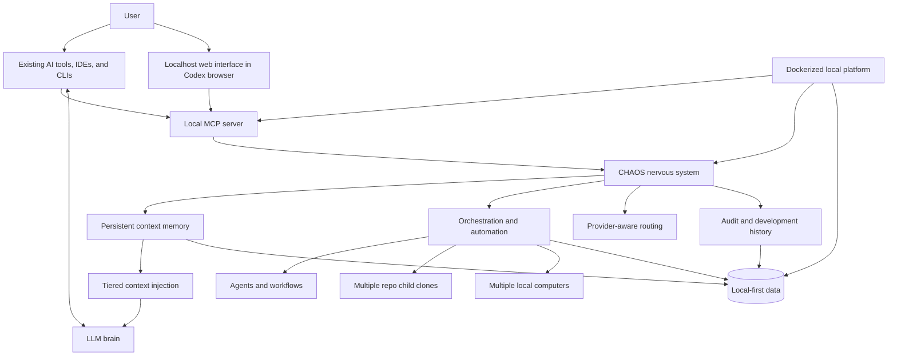

# Architecture Overview

This document describes the **public-safe system shape** of CHAOS.

It intentionally avoids private implementation details. The purpose is to explain the concept clearly enough for readers to understand the major parts without exposing protected mechanics.

## Architectural Posture

CHAOS is a **local-first runtime layer for AI-assisted development**.

The LLM provides reasoning. CHAOS provides the surrounding operating system: memory, routing, orchestration, workflow automation, visibility, and local control.

At a high level, the system is organized around five public-safe layers:

1. **User and AI surfaces** where people and AI tools interact with the system.
2. **MCP and local interface layer** that connects existing provider tools, CLIs, and the localhost web UI.
3. **Runtime nervous system** that routes work, state, events, and coordination signals.
4. **Context and memory layer** that keeps useful project knowledge durable and retrievable.
5. **Automation and orchestration layer** that coordinates tasks, agents, repositories, and machines.
6. **Audit and local data layer** that keeps the system observable and user-controlled.

## Simplified Public Architecture

This diagram is deliberately less detailed than the private architecture. It shows the product concept rather than subsystem internals.

## Deployment And Integration Shape

CHAOS is designed to be deployed locally and connected outward through standard AI-development integration points.

The public deployment strategy is:

- **Dockerized local platform services** for repeatable setup.
- **MCP-compatible local server** as the main protocol boundary.
- **Localhost web interface** for runtime visibility and control, designed to be opened inside the Codex browser.
- **Existing AI provider interfaces and CLIs** as first-class integration targets rather than surfaces to replace.
- **Windows, macOS, and Linux compatibility** through the local runtime and MCP boundary.

This makes CHAOS a local infrastructure layer: AI tools can call into it, users can inspect it through a local web surface, and the operating state remains centered on the user's machine.

## Layer Responsibilities

### 1. User And AI Surfaces

These are the places where users, local tools, and AI assistants interact with CHAOS.

The public-safe concept is simple: CHAOS is designed to sit beside existing AI development tools, provider CLIs, IDE flows, and Codex browser workflows, giving them better operating context, better workflow support, and clearer state.

### 2. MCP And Local Interface Layer

The local MCP server is the main compatibility boundary. It allows CHAOS capabilities to be exposed to MCP-aware tools without publishing private internals.

The localhost web interface is the human-facing operational surface. It is designed for local browser use, including inside the Codex browser, so users can inspect and operate the runtime without moving the center of gravity into a hosted SaaS control plane.

### 3. Runtime Nervous System

This is the central coordination layer.

It is responsible for moving the right signals between memory, tools, agents, providers, workflows, repositories, and local machines. This is why the "nervous system" metaphor matters: the value is not only in storing information, but in sending the right information to the right place at the right time.

### 4. Context And Memory

CHAOS treats context as infrastructure.

Instead of relying on a user to manually paste the right files, notes, and decisions into every new prompt, the system is designed around persistent memory and tiered context injection. Relevant context can be retrieved, ranked, budgeted, and sent to the AI in a controlled way.

This supports:

- continuity across sessions,
- less repeated explanation,
- fewer oversized prompts,
- more relevant model inputs,
- and better use of token budgets.

### 5. Orchestration And Automation

CHAOS is intended to coordinate work across more than one linear chat.

At a public-safe level, this includes:

- planning and execution flows,
- agent and workflow coordination,
- multiple related repository clones,
- multiple local machines,
- repeatable automation for development processes,
- and structured handoff between stages of work.

The important idea is that AI-assisted development should be operated like a system, not improvised from scratch every session.

### 6. Provider-Aware Routing

CHAOS is not defined by one model provider.

The provider layer exists conceptually so different AI tools, models, and provider CLIs can be connected through the operating layer around them. That makes the system less dependent on a single provider and allows work to be routed according to task needs, context needs, and resource constraints.

### 7. Audit And Development History

AI work becomes easier to trust when the process is visible.

CHAOS emphasizes auditable development: what was asked, what changed, what context mattered, what workflow ran, and what state the system reached. This public showcase leans heavily on that same principle by preserving generalized changelogs, development history, and documentation rhythm.

### 8. Local-First Data

CHAOS is designed around a local-first posture.

That means the user machine is the center of gravity. The goal is to support strong AI workflows without requiring project-specific code, working context, or operational history to be centered in mandatory cloud infrastructure.

The Dockerized local deployment strategy supports this posture by making the runtime portable while keeping its operating surfaces local.

## Resource Efficiency

The architecture is built around the belief that better context management is better AI infrastructure.

Large models are expensive to run. Users also have practical limits: token windows, subscription allotments, latency, attention, and trust. CHAOS addresses that by making context selection, workflow routing, and automation part of the runtime instead of leaving every session to brute-force its way through raw project material.

That creates a healthier loop:

- the user spends less time repeating themselves,
- the model receives cleaner input,
- providers see less avoidable token waste,
- and local-first infrastructure keeps more control close to the user.

## What This Document Leaves Out

This overview does not include:

- private source code,
- internal subsystem boundaries,
- exact runtime mechanics,
- protected data schemas,
- unreleased product details,
- or direct copies of private architecture docs.

The goal is to explain what CHAOS is and why its architecture matters without disclosing the implementation.
